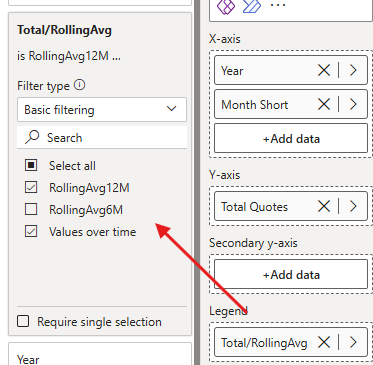

# Testing UDF for multipurpose Rolling Averages

With the recent implementation of User Defined Functions (UDF), new alternatives to copy-pasting measures have been put into place. For some basic aspects such as calculating averages for multiple metrics, the regular use of measures can mean creating a plethora of measures that will inevitable create clutter into the data model.

This situation can be entirely avoided with the use of basic, one-size-fits-all functions, which once defined, can be used as baseline to perform multiple calculations. With the combined use of UDFs and Calculation Groups, the real possibility of avoiding to create measures arises.

With this simple function, a rolling average can be created, with the only requirements being having something to measure and a calendar table. Even if values are blank, it will count said averages until they equal zero, for which it will display blanks for easier usage.

```
DEFINE
    FUNCTION RollingAvgNMonths = (
        metricExpr   : ANYREF EXPR,
        dateCol      : ANYREF EXPR,
        yearMonthCol : ANYREF EXPR,
        numMonths    : SCALAR INT64 VAL
    ) =>
    VAR LastCurrentDate =
        MAX ( dateCol )

    VAR Period =
        DATESINPERIOD ( dateCol, LastCurrentDate, - numMonths, MONTH )

    VAR Result =
        CALCULATE (
            AVERAGEX (
                VALUES ( yearMonthCol ),
                VAR v = CALCULATE ( metricExpr )
                RETURN COALESCE ( v, 0 )
            ),
            Period
        )

    VAR FirstDateInPeriod =
        MINX ( Period, dateCol )

    RETURN
        IF (
            NOT ISBLANK ( LastCurrentDate )
                && FirstDateInPeriod <= LastCurrentDate,
            IF ( Result = 0, BLANK (), Result )
        )

```

Once created, it can be inserted within Calculation items that can be inserted into visuals. For example, to calculate the rolling average of the previous 12 months, the following Calculation Item can be created, using the arguments created in the aforementioned function:

```
RollingAvg12M = RollingAvgMonths(
    SELECTEDMEASURE(),
    'Calendar'[Date],
    'Calendar'[Year Month],
    12
)
```

Once the Calculation Group is inserted into a visual, users can select the visualizations they wish to view, with the following result.



